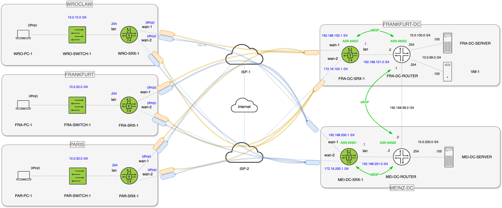

<!-- BEGIN_TF_DOCS -->
# Hub and spoke SD-WAN with Juniper SRX managed with Juniper Mist
## Description

The module allows for rapid deployment of SD-WAN hub and spoke environment based on Juniper SRX managed by Juniper Mist. Branch EX switches can also be included in the deployment. [Example topology](https://github.com/tnonas/terraform-juniper-mist-srx-sdwan/blob/main/modules/srx_hub_and_spoke/README.md):

Note, that only the green colored devices and blue colored IP configuration is covered by the module's contents. The example provided uses this specific addressing. The black and white devices, i.e., PCs, servers and routers are for illustration purposes only and serve as a potential add-on outside the module's scope of automation.

The module creates all Juniper Mist constructs needed for the fully operational environment – sites, organization level WAN networks and services (applications), hub profiles, edge gateway and switch templates.

## Dependencies

- [Juniper Mist account](https://manage.mist.com/signin.html#!signup/register) and an associated Organization ID
- Claimed Juniper Mist compatible [Juniper SRX secure gateways](https://www.juniper.net/documentation/us/en/software/mist/content/mist-supported-hardware.html#xd_a679a623514d95d6-669993c-186f9d4ff5a--7e07__section_srx) or adopted [virtual SRX appliances](https://support.juniper.net/support/downloads/?p=vsrx-evaluation) with AppID license applied.
- Claimed [Juniper EX or QFX switches](https://www.juniper.net/documentation/us/en/software/mist/content/mist-supported-hardware.html#xd_a679a623514d95d6-669993c-186f9d4ff5a--7e07__section_krr_y15_swb) or adopted [vJunos-switch appliances](https://www.juniper.net/us/en/dm/vjunos-labs.html)

Based on the variable values the deployment can also be limited to just SRX devices.

## Example

The example deployment was based on vSRX and vJunos-switch virtual appliances. Example "terraform.tfvars" are provided in module's "example" directory. When copied to the root part of the module (root module) they can be used to configure the provided example topology.

## Requirements

| Name | Version |
|------|---------|
|  [mist](#requirement\_mist) | ~> 0.2.6 |

## Providers

| Name | Version |
|------|---------|
|  [mist](#provider\_mist) | ~> 0.2.6 |

## Modules

No modules.

## Resources

| Name | Type |
|------|------|
| mist_device_gateway.this | resource |
| mist_device_switch.this | resource |
| mist_org_deviceprofile_assign.this | resource |
| mist_org_deviceprofile_gateway.this | resource |
| mist_org_gatewaytemplate.this | resource |
| mist_org_inventory.this | resource |
| mist_org_network.this | resource |
| mist_org_networktemplate.this | resource |
| mist_org_service.this | resource |
| mist_org_sitegroup.this | resource |
| mist_site.this | resource |
| mist_site_setting.this | resource |

## Inputs

| Name | Description | Type | Default | Required |
|------|-------------|------|---------|:--------:|
|  [edge\_template](#input\_edge\_template) | Edge templates to be applied to sites with WAN Edge spoke devices | <pre>map(object({     name        = string     type        = string     port_config = any     ip_configs = map(object({       type    = string       ip      = string       netmask = string     }))     dhcpd_config = any     path_preferences = any     service_policies = any   }))</pre> | n/a | yes |
|  [hub\_profiles](#input\_hub\_profiles) | Device profiles definitions to be applied to WAN Edge hub devices | <pre>map(object({     name        = string     port_config = any     ip_configs = map(object({       type    = string       ip      = string       netmask = string     }))     path_preferences = any     service_policies = any     routing_policies = any     bgp_config = any   }))</pre> | n/a | yes |
|  [inventory](#input\_inventory) | Definition of all devices (WAN gateways – hubs and spokes, and switches) | <pre>map(object({     name = string     type = string     hub_device_profile = string     site_id = string     unclaim_when_destroyed = bool   }))</pre> | n/a | yes |
|  [name-prefix](#input\_name-prefix) | A name prefix for resource naming. Please note that some names inside nested variables will have explicit names only. | `string` | n/a | yes |
|  [networks](#input\_networks) | Org level WAN networks to be created | <pre>map(object({     name                   = string     subnet                 = string     vlan_id                = any     disallow_mist_services = bool     vpn_access = object({       OrgOverlay = object({         routed                     = bool         no_readvertise_to_overlay  = bool         no_readvertise_to_lan_bgp  = bool         no_readvertise_to_lan_ospf = bool       })     })   }))</pre> | n/a | yes |
|  [org\_id](#input\_org\_id) | Target Juniper Mist organization ID for all automation operations | `string` | n/a | yes |
|  [root\_password](#input\_root\_password) | Root password for WAN Edges. Note that root password for switches has to be provided explicitly inside switch template variable. | `string` | n/a | yes |
|  [services](#input\_services) | Org level WAN services (applications) to be created | <pre>map(object({     name      = string     type      = string     addresses = list(string)     apps      = list(string)     specs = list(object({       protocol   = string       port_range = string     }))     traffic_type = string   }))</pre> | n/a | yes |
|  [sites](#input\_sites) | Definition of the sites to be deployed | <pre>map(object({     role           = string     name           = string     country_code   = string     timezone       = string     address        = string     notes          = string     latlng         = map(number)     vars           = map(string)     wan_devices    = list(string)     switch_devices = list(string)   }))</pre> | n/a | yes |
|  [switch\_template](#input\_switch\_template) | Org level network templates for switches | <pre>map(object({     name = string     switch_mgmt = any     networks = any     port_usages = any     # disabled_system_defined_port_usages = any     switch_matching = any   }))</pre> | n/a | yes |

## Outputs

No outputs.
<!-- END_TF_DOCS -->    